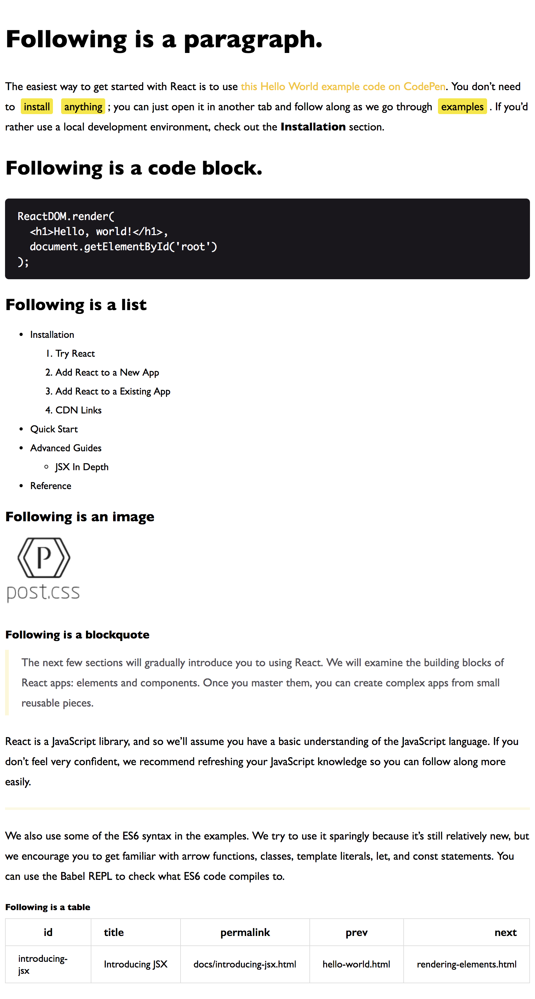

<p align="center"></p>

### [English Documentation](./README.md)

为markdown准备的CSS样式表

## 在哪里使用？
我在我的hexo主题[hexo-theme-crafts](https://github.com/jeffwcx/hexo-theme-crafts)中使用该样式表，你可以在文章页中使用该样式。


## 预览


## 安装

### 在Sass/Scss中使用

```
npm i -D post-style
```

```scss
@import "~post-style";
```

### 在CSS中使用

```html
<!-- cdn -->
<link rel="stylesheet" href="https://unpkg.com/post-style@1.0.0/lib/post.min.css">
```